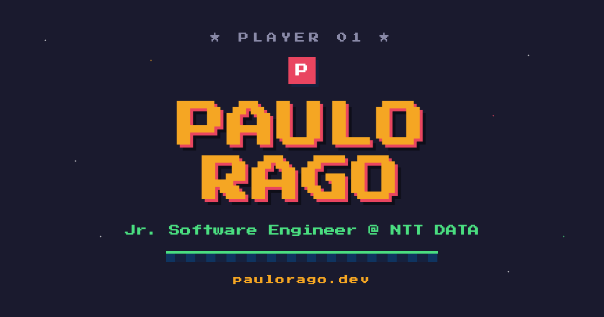

# 🎮 Paulo Rago — Portfólio

Portfólio pessoal em estilo **retro game / pixel-art 8-bit**, onde cada seção é apresentada como a tela de um videogame: da tela de **PRESS START** até a de **SALVAR PROGRESSO**.

🔗 **Online:** https://paulorago.dev



---

## ✨ Destaques

- 🕹️ **Tema de videogame retro** — seções como fases de um jogo:
  - `PRESS START` (hero) · `STATUS DO PERSONAGEM` (sobre, em formato de ficha RPG) · `INVENTÁRIO / MOVESET` (skills) · `MAPA DE FASES` (trajetória) · `CHEFES DERROTADOS` (projetos) · `ACHIEVEMENTS` (conquistas) · `SALVAR PROGRESSO` (contato)
- 🎨 **Pixel-art em SVG** — sprite do personagem e cachorros desenhados à mão em SVG, com animações (`bob`, ciclo de pernas, chão em scroll infinito)
- 🌌 **Atmosfera CRT** — campo de estrelas com cintilação, *scanlines* e *vignette* simulando uma TV antiga
- ⌨️ **Efeitos** — texto com *typing effect*, barras de XP animadas, *tooltips* que seguem o cursor
- 🔊 **Som 8-bit** — efeitos sonoros gerados em tempo real via **Web Audio API** (osciladores), com botão liga/desliga
- 🥚 **Easter egg** — digite o **Konami Code** (↑ ↑ ↓ ↓ ← → ← → B A) para desbloquear o "1-UP / MODO DEV"
- 🧭 **Navegação inteligente** — *scroll-spy* com `IntersectionObserver`, rolagem suave e menu **PAUSE** no mobile
- 📱 **Responsivo** — adapta layout e navegação para telas pequenas

## 🛠️ Tecnologias

**Front-end**
- HTML5 + CSS3 (animações com `@keyframes`, `clamp()`, layout flex/grid)
- **SVG** inline para toda a pixel-art
- **JavaScript** (componente com lógica em classe) + **React 18** auto-hospedado
- **Web Audio API** (efeitos sonoros) · **IntersectionObserver** (scroll-spy)
- Tipografia: **Press Start 2P** + **Inter** (Google Fonts)

**Infra / Deploy**
- **GitHub Pages** com domínio próprio (`paulorago.dev`) e **HTTPS**
- Sem dependência de CDN em runtime — o React fica versionado em `/vendor`
- SEO: `<title>`, meta description, **Open Graph** + Twitter Card e favicon

**Stack exibida no portfólio** (skills do Paulo): Java · Spring · Nest.js · FastAPI · React · TypeScript · Kubernetes · Docker · Python · Pandas · MySQL · PostgreSQL

## 🚀 Rodando localmente

O site precisa ser servido por **HTTP** (não abra via `file://`, pois o runtime usa `fetch`):

```bash
# a partir da raiz do projeto
python3 -m http.server 8000
# abra http://localhost:8000
```

## 📦 Estrutura

```
index.html              # página (template + lógica do componente)
support.js              # runtime que renderiza o componente (não editar — é gerado)
vendor/                 # React 18 auto-hospedado (sem CDN em runtime)
og.png                  # imagem de preview (Open Graph) 1200×630
favicon.svg / *.png     # ícones
CNAME                   # domínio próprio (paulorago.dev)
```

## 🌐 Deploy

Publicado automaticamente pelo **GitHub Pages** a cada `push` na branch `main` (build em ~1 min).

---

Feito com ❤️ & pixels · Recife-PE · &copy; 2026 Paulo Rago
